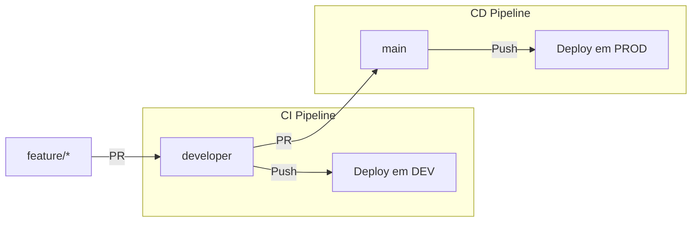

# Template Corporativo DAB (Databricks Asset Bundles) com GitHub Actions

Este repositório contém um **template corporativo** padronizado para a criação de projetos no Databricks utilizando **Declarative Automation Bundles (DABs)**. 

O objetivo deste template é automatizar e padronizar o *onboarding* de novos projetos de dados, garantindo que todos os projetos nasçam com:
1. **Infraestrutura como Código (IaC)** via `databricks.yml`.
2. **Esteiras de CI/CD prontas** no GitHub Actions.
3. **Tags FinOps e Governança** obrigatórias configuradas desde o dia zero.
4. **Isolamento de Ambientes** (Target `dev` e `prod`) com Unity Catalog.
5. **Autenticação OIDC** (sem secrets manuais ou tokens de longa duração).
6. **Ambiente Python otimizado** com `uv` e `pytest`.

---

## 🚀 Como Inicializar um Novo Projeto

Para criar um novo projeto a partir deste template, utilize o Databricks CLI:

```bash
databricks bundle init https://github.com/marllonDev/template-dab
```

O CLI iniciará um prompt interativo solicitando as seguintes informações:
- Nome do projeto
- Sistema, Departamento e Stakeholders (Tags FinOps)
- Nomes dos catálogos Unity Catalog (DEV e PROD) e o schema base

Após responder, uma pasta com o nome do projeto será gerada contendo toda a estrutura pronta.

---

## ⚙️ Configurações Necessárias no Repositório Gerado (GitHub)

Uma vez que o novo projeto foi criado e feito o primeiro push para um repositório no GitHub, você precisará configurar o repositório para que as esteiras de CI/CD funcionem corretamente.

### 1. Criar GitHub Environments
Vá na aba **Settings > Environments** do seu novo repositório e crie dois ambientes:
- `dev`
- `prod` (⚠️ Marque a opção **Required reviewers** e adicione os aprovadores para garantir que ninguém faça deploy em produção sem revisão humana).

### 2. Configurar as Variáveis de Ambiente (Environment Variables)
Dentro de cada ambiente (`dev` e `prod`), crie as seguintes **Environment Variables** (em *Environment secrets and variables* -> aba *Variables*):

| Variável | Descrição | Exemplo |
|---|---|---|
| `DATABRICKS_HOST_DEV` / `_PRD` | URL do Workspace do Databricks | `https://adb-123456789.azuredatabricks.net` |
| `DATABRICKS_CLIENT_ID_DEV` / `_PRD` | Client ID (Application ID) do Service Principal | `1234abcd-1234-abcd-1234-abcd1234abcd` |

*(A autenticação via `github-oidc` não requer secrets/tokens de senha. O Databricks fará a validação do token JWT do GitHub usando esse `CLIENT_ID`)*

### 3. Configurar Branch Protection Rules
Vá em **Settings > Branches** e crie regras de proteção para:
- `developer`: Exigir Pull Request, exigir status checks do CI (o job `Gate 1 + Deploy DEV`).
- `main`: Exigir Pull Request, exigir status checks.

---

## 🔀 Estratégia de Branching e Deploy (O Fluxo CI/CD)

O template implementa a seguinte arquitetura de esteira de promoção:



1. **Desenvolvimento**: O dev trabalha em sua branch `feature/X`.
2. **Integração (CI)**: O dev abre um PR para a branch `developer`. Quando ocorre o merge, o GitHub Actions dispara o **`ci.yml`**:
   - Roda testes unitários (`pytest`).
   - Valida o código do DAB (`databricks bundle validate`).
   - Faz o deploy no workspace de DEV.
3. **Produção (CD)**: Quando DEV está estável, abre-se um PR de `developer` para `main`. Após aprovação humana e merge, o **`cd.yml`** é disparado:
   - Faz o deploy do código empacotado no workspace de PROD.
   - Força a execução (`bundle run`) para atualizar o serviço.
   - Faz um Health Check (Sondagem Ativa) de 5 minutos garantindo que a execução foi bem sucedida.

Para mais detalhes sobre as decisões de design, consulte o [Documento de Arquitetura (arq.md)](arq.md).
