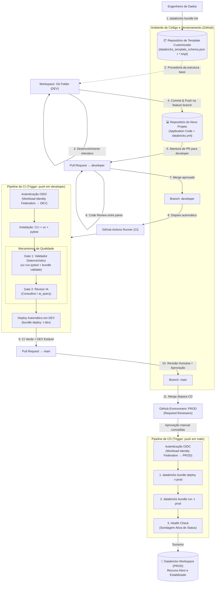

# Nova Arquitetura de Esteira CI/CD para Databricks com GitHub Actions e DABs

## 1. Objetivo e Visão Geral

Este documento apresenta a arquitetura consolidada e otimizada para a nova esteira DevOps de dados para projetos Databricks. A solução elimina a dependência de credenciais estáticas de longa duração, padroniza a criação de projetos através de fôrmas corporativas e garante a integridade pós-implantação por meio de validações determinísticas e automação de testes.

A fundação técnica utiliza **Declarative Automation Bundles (DABs)** (anteriormente conhecidos como Databricks Asset Bundles) como a especificação de Infraestrutura como Código (IaC) e o **GitHub Actions** como motor principal de orquestração de CI/CD.

---

## 2. Desenho da Arquitetura Alvo

O diagrama a seguir descreve o fluxo integrado completo, destacando o papel estratégico do **Repositório de Template Customizado** no provisionamento inicial, a estratégia de branching (`feature` → `developer` → `main`) e os mecanismos de segurança e validação durante o ciclo de promoção.



---

## 3. Pilares Estruturais da Solução

### 3.1. Padronização na Origem: O Repositório de Template Customizado

A estratégia de governança estabelece o conceito de *paved road* (estrada pavimentada). Nenhum projeto inicia de forma isolada ou manual.

* O time consome um repositório central de template contendo a infraestrutura declarativa base.
* O comando de inicialização lê a fôrma corporativa e interage com o engenheiro para preencher variáveis essenciais:
```bash
databricks bundle init https://github.com/sua-org/seu-bundle-template
```

* O projeto gerado já nasce contendo a topologia de catálogos Unity Catalog correta por ambiente, as tags de controle financeiro obrigatórias (`system`, `environment`, `department`, `stakeholders`) e a identidade técnica parametrizada.

### 3.2. Estratégia de Branching

O modelo de branching segue uma estrutura de promoção progressiva com três camadas:

| Branch | Finalidade | Proteção |
|---|---|---|
| `feature/*` | Desenvolvimento individual | Nenhuma (branch do desenvolvedor) |
| `developer` | Integração e validação em DEV | PR obrigatório, CI automático |
| `main` | Produção | PR obrigatório, aprovação humana, CD automático |

**Fluxo:**
1. O desenvolvedor cria uma branch `feature/nome_funcionalidade` a partir de `developer`.
2. Ao concluir, abre um **Pull Request para `developer`** com code review entre pares.
3. Após merge em `developer`, a **esteira de CI** é disparada automaticamente.
4. Com CI verde e DEV estável, abre-se um **Pull Request para `main`**.
5. Um **aprovador humano** revisa e aprova o PR para `main`.
6. O merge em `main` dispara a **esteira de CD** com deploy em produção.

### 3.3. Federação de Identidades via OIDC (Workload Identity)

Seguindo as diretrizes modernas de segurança, a esteira abandona o uso de senhas ou tokens de acesso pessoais (PATs) armazenados em segredos de longa duração.

* O GitHub Actions autentica-se nativamente no Databricks utilizando tokens OIDC de curta duração.
* O Databricks confia no emissor de tokens do GitHub por meio de uma *Federated Credential* atrelada a um **Service Principal**.
* Para habilitar esse comportamento, o fluxo de execução exige a permissão estrutural `id-token: write`.

### 3.4. Otimização de Testes Locais com `uv` (Gate 1)

O **Gate 1** atua de forma determinística e impeditiva (bloqueante). Ele garante que nenhum código quebre regras de negócio ou de infraestrutura antes de chegar ao workspace.

* A esteira utiliza o gerenciador **`uv`**, que reduz drasticamente o tempo de inicialização do ambiente virtual do Python se comparado ao `pip` tradicional.
* Os testes de unidade e de validação de esquemas são disparados localmente no runner através do comando: `uv run pytest -s`.

### 3.5. Ciclo de Vida Pós-Deploy e Mecanismo de Health Check

Uma premissa crítica da documentação oficial da Databricks é que o comando `databricks bundle deploy` atualiza com sucesso os artefatos de infraestrutura no workspace, mas **não reinicia o processo em execução**.

* Para que as alterações de código entrem em vigor imediatamente (especialmente em Databricks Apps ou pipelines agendados), a esteira executa o recurso explicitamente após a implantação: `databricks bundle run <resource_key>`.
* **Health Check (Sondagem Ativa):** Para evitar o cenário de "falso positivo" (onde o deploy passa mas a aplicação falha na inicialização por falta de pacotes ou variáveis de ambiente), o pipeline executa um loop de verificação controlada (*polling*) inspecionando o estado real do recurso via CLI e utilitário `jq`. Se o recurso não atingir estabilidade em até 5 minutos, a esteira é abortada como falha.

---

## 4. Workflows de Implantação Consolidados (GitHub Actions)

### 4.1. Pipeline de CI — `ci.yml` (Trigger: PR → `developer`)

```yaml
name: CI - Validação e Deploy DEV

on:
  push:
    branches:
      - developer

permissions:
  id-token: write
  contents: read

defaults:
  run:
    working-directory: .

jobs:
  ci-dev:
    name: Gate 1 + Gate 2 + Deploy DEV
    runs-on: ubuntu-latest
    environment: dev

    env:
      DATABRICKS_AUTH_TYPE: github-oidc
      DATABRICKS_HOST: ${{ vars.DATABRICKS_HOST_DEV }}
      DATABRICKS_CLIENT_ID: ${{ vars.DATABRICKS_CLIENT_ID_DEV }}

    steps:
      - name: Checkout do Código
        uses: actions/checkout@v4

      - name: Instalar Databricks CLI
        uses: databricks/setup-cli@main

      - name: Instalar Gerenciador uv
        uses: astral-sh/setup-uv@v4

      - name: Gate 1 - Executar Testes Automatizados (pytest)
        run: uv run pytest -s

      - name: Gate 1 - Validação Estrutural do Bundle
        run: databricks bundle validate --target dev

      - name: Deploy do Bundle para DEV
        run: databricks bundle deploy --target dev
```

### 4.2. Pipeline de CD — `cd.yml` (Trigger: push em `main`)

```yaml
name: CD - Deploy Produção

on:
  push:
    branches:
      - main
  workflow_dispatch:

permissions:
  id-token: write
  contents: read

defaults:
  run:
    working-directory: .

jobs:
  deploy-prd:
    name: Implantação e Verificação PROD
    runs-on: ubuntu-latest
    environment: prod

    env:
      DATABRICKS_AUTH_TYPE: github-oidc
      DATABRICKS_HOST: ${{ vars.DATABRICKS_HOST_PRD }}
      DATABRICKS_CLIENT_ID: ${{ vars.DATABRICKS_CLIENT_ID_PRD }}

    steps:
      - name: Checkout do Código
        uses: actions/checkout@v4

      - name: Instalar Databricks CLI
        uses: databricks/setup-cli@main

      - name: Instalar Gerenciador uv
        uses: astral-sh/setup-uv@v4

      - name: Deploy do Bundle para Produção
        run: databricks bundle deploy --target prod

      - name: Executar Recurso para Atualização de Código
        run: databricks bundle run nome_do_seu_job_ou_app --target prod

      - name: Health Check - Sondagem Ativa de Inicialização
        run: |
          echo "Iniciando monitoramento ativo do status do recurso..."
          for i in $(seq 1 20); do
            RESPONSE=$(databricks jobs get --job-name "nome_do_seu_job_ou_app" --output json 2>/dev/null || echo '{}')
            LIFECYCLE=$(echo "$RESPONSE" | jq -r '.state.life_cycle_state // "PENDING"')
            RESULT=$(echo "$RESPONSE" | jq -r '.state.result_state // "UNKNOWN"')
            echo "Tentativa $i/20: lifecycle=$LIFECYCLE result=$RESULT"
            
            if [[ "$LIFECYCLE" == "TERMINATED" && "$RESULT" == "SUCCESS" ]]; then
              echo "✅ Recurso finalizado com sucesso no workspace de Produção."
              exit 0
            fi
            
            if [[ "$LIFECYCLE" == "RUNNING" ]]; then
              echo "✅ Recurso em execução estável no workspace de Produção."
              exit 0
            fi
            
            if [[ "$LIFECYCLE" == "INTERNAL_ERROR" || "$RESULT" == "FAILED" || "$LIFECYCLE" == "SKIPPED" ]]; then
              echo "❌ Falha crítica detectada: lifecycle=$LIFECYCLE result=$RESULT" >&2
              exit 1
            fi
            sleep 15
          done
          
          echo "⚠️ Timeout: O recurso não atingiu um estado estável dentro de 5 minutos." >&2
          exit 1
```

---

## 5. Mapeamento de Próximos Artefatos

Para a materialização completa desta esteira, o time de engenharia deve focar na construção dos seguintes componentes sequenciais:

1. **Repositório de Template (`seu-bundle-template`):** Criação dos arquivos `.tmpl` estruturantes. ✅ *Em andamento*
2. **Políticas de Federação no Azure/Databricks:** Configuração do *trust relationship* entre o emissor do GitHub OIDC e o Service Principal atrelado ao Unity Catalog.
3. **Calibragem do Script do Gate 2:** Desenvolvimento das regras semânticas de IA integradas via comentários no Pull Request.
4. **Branch Protection Rules:** Configuração de proteções para `developer` (exigir PR + CI verde) e `main` (exigir PR + aprovação humana + CI verde).